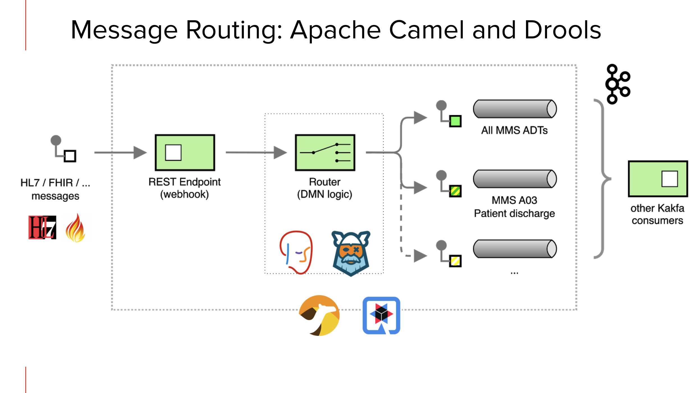

# Kafka intelligent message routing using Quarkus, Kogito DMN, Camel

This demo is a further iteration of rule-based Kafka message routing; using Quarkus, Kogito, DMN, Camel.

This demo is inspired by the use-case of Intelligent message routing for healthcare from Red Hat's [iDaaS project](https://connectedhealth-idaas.io), focusing on Apache Camel and Drools DMN Engine integration.
For the previous demo, you can reference this [demo recording](https://www.youtube.com/watch?v=tNe6QU1Yq8U) and some additional technological details in this [blog post](https://blog.kie.org/2021/06/intelligent-kafka-message-routing-using-drools-dmn-engine-and-apache-camel.html). The previous demo code is accessible [here]()

This project now uses Quarkus, the Supersonic Subatomic Java Framework.

## Technologies used

- [Quarkus](https://quarkus.io)
- [Apache Camel](https://camel.apache.org) 
- [Kogito](https://kogito.kie.org)
- [DMN](https://drools.org/learn/dmn.html) standard for defining the business rules logic

## Requirements

- [Maven](https://maven.apache.org/) 3.6.2 or later
- [Java](https://openjdk.java.net/install/) 11 or later 
- Docker installation for running integration tests and manual demo

# Demo objectives

Showcase the ability to route data real time and create new topics on demand as needed to help facilitate information processing and addressing needs for business in real time.



- HL7 `ADT` messages from `MMS` application routed to `MMSAllADT` kafka topic
- HL7 `ADT` messages from `MMS` application for `A03` "_Patient Discharge_" are also routed to `MMSDischarges` kafka topic
- etc.

Routing rules are implemented with DMN:


# Building and Running

Integration test during the Maven build phase checks the same Camel route used for intelligent routing of HL7 / iDAAS EventBuilder messages.

## Running the application in dev mode

You can run your application in dev mode that enables live coding using:
```shell script
./mvnw compile quarkus:dev
```

> **_NOTE:_**  Quarkus now ships with a Dev UI, which is available in dev mode only at http://localhost:8080/q/dev/.

## Packaging and running the application

The application can be packaged using:
```shell script
./mvnw package
```
It produces the `quarkus-run.jar` file in the `target/quarkus-app/` directory.
Be aware that it’s not an _über-jar_ as the dependencies are copied into the `target/quarkus-app/lib/` directory.

If you want to build an _über-jar_, execute the following command:
```shell script
./mvnw package -Dquarkus.package.type=uber-jar
```

The application will be runnable using `java -jar target/quarkus-app/quarkus-run.jar`.

# Running the application demo (locally)

The demo can be run locally with the successfully built solution artifacts, following the steps below.

Launch a simple Kafka cluster where the messages will be routed in the different Kafka topics.

```
docker-compose up -d
```

Launch the default iDAAS DREAM demo

```
java -jar target/quarkus-app/quarkus-run.jar
```

Sending an HL7 message for `A03` will show being routed to the `MMSAllADT` and `MMSDischarges` Kafka topics

```sh
curl --location --request POST 'localhost:8080/hl7v2/new' \
--header 'Content-Type: text/plain' \
--data-raw 'MSH|^~\&|MMS|DH|LABADT|DH|201301011226||ADT^A03|HL7MSG00001|P|2.3|
EVN|A01|201301011223||
PID|||MRN12345^5^M11||APPLESEED^JOHN^A^III||19710101|M||C|1 DATICA STREET^^MADISON^WI^53005-1020|GL|(414)379-1212|(414)271-3434||S||MRN12345001^2^M10|123456789|987654^NC|
NK1|1|APPLESEED^BARBARA^J|WIFE||||||NK^NEXT OF KIN
PV1|1|I|2000^2012^01||||004777^GOOD^SIDNEY^J.|||SUR||||ADM|A0|'
```

Sending an HL7 message for `A02` will show being routed to the `MMSAllADT` Kafka topic only

```sh
curl --location --request POST 'localhost:8080/hl7v2/new' \
--header 'Content-Type: text/plain' \
--data-raw 'MSH|^~\&|MMS|1|||20050110114442||ADT^A02|59910287|P|2.3|||
EVN|A02|20050110114442|||||
PID|1||10006579^^^1^MRN^1||DUCK^DONALD^D||19241010|M||1|111^DUCK ST^^FOWL^CA^999990000^^M|1|8885551212|8885551212|1|2||40007716^^^AccMgr^VN^1|123121234|||||||||||NO
PV1|1|I|IN1^214^1^1^^^S|3||PREOP^101^|37^DISNEY^WALT^^^^^^AccMgr^^^^CI|||01||||1|||37^DISNEY^WALT^^^^^^AccMgr^^^^CI|2|40007716^^^AccMgr^VN|4|||||||||||||||||||1||I|||20050110045253||||||'
```

Stop the demo by quitting the java application and stop the simple Kafka cluster from the root of this project using

```
docker-compose down
```


<!-- ## Creating a native executable

You can create a native executable using: 
```shell script
./mvnw package -Pnative
```

Or, if you don't have GraalVM installed, you can run the native executable build in a container using: 
```shell script
./mvnw package -Pnative -Dquarkus.native.container-build=true
```

You can then execute your native executable with: `./target/code-with-quarkus-1.0.0-SNAPSHOT-runner`

If you want to learn more about building native executables, please consult https://quarkus.io/guides/maven-tooling.html.

## Provided Code

### RESTEasy JAX-RS

Easily start your RESTful Web Services

[Related guide section...](https://quarkus.io/guides/getting-started#the-jax-rs-resources) -->
